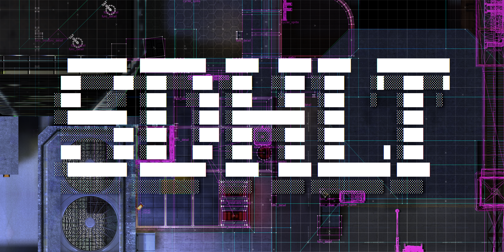

# ReSDHLT

Map compile tools for GoldSrc, aimed squarely at Counter-Strike 1.6.

This is a fork of [seedee/SDHLT](https://github.com/seedee/SDHLT), which is itself
descended from Vluzacn's ZHLT and from Valve's original tools. The goal here is
narrow. Compiles should be faster, the output should be reproducible, and when a
map is broken the compiler should say what is broken and where, instead of
leaving a pointfile and a shrug.

Everything claimed below was measured on real maps. The numbers, including the
ones that came out negative, live in [`docs/BENCHMARKS.md`](docs/BENCHMARKS.md).

## Installing

Download the latest Windows package from
[Releases](https://github.com/metita/ReSDHLT/releases) and unzip it anywhere.
Inside you get `resdhlt-gui.exe` and a `tools/` folder.

If you use the GUI, that is the whole installation. Open it, point it at your
`.map`, press compile.

If you compile from an editor such as J.A.C.K. or Hammer, open its compile
configuration and set the four tool paths to `sdHLCSG.exe`, `sdHLBSP.exe`,
`sdHLVIS.exe` and `sdHLRAD.exe` from `tools/`. Then add `tools/sdhlt.wad` to your
WAD list, which is required for the tool textures to work, and `tools/sdhlt.fgd`
to your FGD list.

## What this fork changes

### Compiles are faster

RAD is over 95% of a compile, so that is where the work went.

The default sky sampling level dropped from 7 to 6. That alone is about **1.65x
faster RAD** for a worst case difference of 1/255 on a single luxel. Pass
`-skylevel 7` to get upstream lighting back exactly.

On top of that, a series of changes to the lighting inner loops takes another
5 to 13% off RAD's CPU time depending on the map. Samples whose PVS cannot reach
any sky brush now skip the sky loop instead of casting thousands of rays that
were always going to be occluded. The BSP walk in `TestLine_r` iterates instead
of recursing on its tail positions, which matters because it is entered around
1.85 billion times per map. Ray tests against opaque entities check one bounding
box for the whole list before walking it. The sample interpolation works out a
phong normal once per sample rather than once per candidate patch, and reuses its
scratch buffers per thread rather than allocating about 1.2 million times per
map. Every one of those was verified to produce a byte identical `.bsp`.

The optional AVX2 RAD build is another 4 to 5% faster. Releases publish it as a
separate `-avx2` ZIP; the normal Windows ZIP and new source builds are portable
so they do not silently crash on an older CPU.

Threading was broken in ways that cost far more than any of the above. Linux
builds ran single threaded unless you passed `-threads` explicitly. Windows
machines with more than 32 logical processors fell back to one thread. Passing
`-threads 5000` overflowed a stack buffer and crashed. All three are fixed, and
`koth_sandy` went from 2.88s to 1.71s purely by using the cores that were already
there.

### The same map gives the same file

Two compiles of one map used to produce different BSP files, because CSG numbered
planes and ordered faces by whichever thread finished first. Compiles are now
reproducible by default, which is what makes "verified byte identical" a
meaningful statement anywhere in this repository. Pass `-nodeterministic` to CSG
if you want the old behaviour back.

### Broken maps say what is broken

**Leaks point at the hole.** The classic pointfile was a side effect of the
outside flood fill. It recorded whatever order the recursion happened to unwind
in, so it wanders across the map, doubles back, and never marks the place where
the inside actually opens onto the void. ReSDHLT builds the trail separately once
the leak is proved: a shortest path over the portal graph from the leaked entity
to the outside, simplified so the `.lin` file is a handful of clean segments. The
hole itself gets its coordinates printed and a dense marker star written into the
`.pts`, so it cannot be missed in the editor. Every hull that leaks is reported
once at the end instead of repeating the same warning four times. `-allleaks`
surveys the map and marks every hole, so a leaky map can be sealed in one pass
through the editor rather than one hole per compile.

**Lightmap atlas overflow is caught before the lighting runs.** GoldSrc packs
every lit face into 64 pages of 128x128 luxels and aborts the map load with
`AllocBlock: full` when they do not fit. That used to be discovered after a full
compile, or in game. RAD now runs the engine's own allocator up front. Past 95%
of the budget it prints a breakdown by texture ranked by lightmap footprint, so
the textures worth rescaling are named:

```
!!! ERROR: LIGHTMAP ATLAS OVERFLOW - map exceeds the engine's 64 page limit
    usage    71 / 64 pages (111%)
    cause    too many lightmapped luxels, so the engine aborts with "AllocBlock: full"
    action   raise the texture scale on the biggest consumers below, or make them smaller

    Lightmap atlas budget by texture (top consumers):
      texture                  faces       luxels  % budget
      --------------------------------------------------------------
      dev_r3_cs2y2             2,258      242,850     72.0%
      dev_c3_dhmsl0            1,702      119,917     36.6%
```

`-lmoptimize` in BSP goes one step further and reorders faces so the allocator
wastes fewer pages. It measures three legal orders against the engine's own
packer and keeps the best, so it can never come out worse than before. It is off
by default, which keeps the default output byte identical to previous versions.

**`-texchart` in CSG reports what each texture costs the BSP.** Useful when you
are hunting for the thing that blew up your texture data or your face count.

### Optional GPU lighting

`-gpu` forces RAD's compatible direct-light gathering and Sparse transfer-factor
construction through Vulkan compute. `-gpuauto` is the recommended switch: it
measures each phase separately and keeps small work on the CPU, without opening
the Vulkan device until a phase crosses its workload threshold. Direct-light
speed depends on how many lights the map has;
transfer-factor speed depends on how many visible patch pairs `MakeScales` has
to evaluate. Same room, same settings, only the light count changing, on a GTX
1060 against six CPU threads with `-extra`:

| lights | CPU | `-gpu` | speedup |
|---:|---:|---:|---|
| 1 | 0.66s | 1.32s | 0.50x, slower |
| 256 | 1.59s | 1.29s | 1.23x |
| 512 | 2.27s | 1.31s | 1.73x |
| 1024 | 3.91s | 1.72s | 2.27x |

CPU time grows linearly with the light count, because every sample walks the
lights its PVS can see one at a time. Time on the device barely moves across a
1024x increase. The crossover sits around 150 to 200 lights, so a heavily lit map
gains and a map with a single `light_environment` loses.

The output is byte identical to the CPU path on almost everything measured. The
one exception differed by a single byte in 95,982, by one step out of 255,
because the kernel normalises in float. It declines and hands the work back to
the CPU, saying why, when the map has opaque entities, studio model shadows, more
light styles than the kernel has slots, a BSP deeper than its traversal stack, or
when no Vulkan driver is present.

The transfer kernel is used with `-vismatrix sparse`, the default. It walks the
sparse visibility pairs directly instead of testing the full patches-squared
matrix. Patch and winding data are uploaded once per compile and the pair/result
buffers are reused across every batch. It falls back to the CPU implementation for RGB transfers, translucent
patches, and custom bounce shadows. A style-0 **single-bounce** accumulation
kernel is also available; multi-bounce runs deliberately stay on the CPU for
deterministic lightmap bytes because a GPU float round-off can compound on the
next iteration. The bounce phase is much smaller than constructing transfers
(on `ze_cardinal`, 12 bounces totalled about 6 seconds while `MakeScales` alone
took 58.43 seconds).

It is off by default. Building it needs nothing extra, since the Khronos headers
and the compiled SPIR-V are both in the tree and the Vulkan loader is opened by
name at runtime.

### A front end that explains itself

`gui/` is a dark theme compiler front end written in Rust with egui. Pick a map,
pick a preset, press compile, watch the log. Every option carries a tooltip
saying what it does and when to use it, and there is a tab summarising the
recommendations that the benchmarks actually support.

It updates itself from GitHub Releases. The check runs asynchronously on launch,
but installation always requires an explicit click and is blocked while a
compile is in progress. The menu has a switch to turn checks off.

```sh
cd gui
cargo run --release
```

### Other fixes worth knowing about

`BEVELHINT` never did anything. The brush parser tested for it in a place it
could not reach, so a texture people had been using for years was silently inert.
It works now, and `sdhlt.fgd` documents it along with `SOLIDHINT`.

`zhlt_embedlightmap` used to break every surface GoldSrc identifies by texture
name. Baking renames the texture, so water stopped waving, conveyors stopped
scrolling, and transparent surfaces stopped being transparent. The baked names
now preserve the prefix the engine looks for. The same feature also produces 24
to 34% less texture data than it used to.

CSG accepts 512 WAD paths instead of 128. The old ceiling is easy to hit with a
large texture library, and CSG aborted rather than ignoring the excess.

## Flags this fork adds

| Tool | Flag | What it does |
|---|---|---|
| CSG | `-texchart` | Report what each texture costs the BSP |
| CSG | `-mergeentities` | Fold equivalent static brush entities into one |
| CSG | `-nodeterministic` | Restore the old thread ordered, irreproducible output |
| CSG | `-noconvexfix` | Keep non-planar brushes as the three points of each face say |
| CSG | `-convexgap N` | Smallest editor/plane mismatch that rebuilds a brush, default 0.2 |
| BSP | `-lmoptimize` | Reorder faces to waste fewer lightmap atlas pages |
| BSP | `-allleaks` | Mark every hole, not just the first one found |
| RAD | `-skylevel N` | Sky sampling fineness, 4 to 8, default 6 |
| RAD | `-gpu` | Compute direct lighting and Sparse transfer factors with Vulkan |
| RAD | `-gpuauto` | Select CPU or Vulkan independently for each phase by workload |
| RAD | `-gpu-gather` | Enable only compatible direct-light gathering on Vulkan |
| RAD | `-gpu-transfers` | Enable only Sparse transfer-factor construction on Vulkan |
| RAD | `-nogpu-gather` | Exclude gather when using `-gpu` or `-gpuauto` |
| RAD | `-nogpu-transfers` | Exclude Sparse transfers when using `-gpu` or `-gpuauto` |
| RAD | `-gpuadapter N` | Pick the Vulkan device by index |
| RAD | `-noallocblockcheck` | Compile even when the map overflows the lightmap atlas |
| RAD | `-profile` | Report where RAD spends its time, no external profiler needed |
| RAD | `-raybench` | Benchmark real sky rays through RAD's BSP tracer |
| RAD | `-workbench` | Measure per-face work balance and scheduling overhead |
| RAD | `-ao` | Ray-traced ambient occlusion, ported from seedee/SDHLT |
| RAD | `-aoall` | Ambient occlusion on all light, texlights and bounces included |
| RAD | `-aoscale N` | AO ray length in units, 1 to 1024, default 32 |
| RAD | `-aogain N` | AO falloff exponent, 0.125 to 8, default 1 |
| RAD | `-aolevel N` | AO rays per sample: 1 = 6, 2 = 18, 3 = 66, 4 = 258, default 3 |
| RAD | `-aominweight N` | Skip AO rays under this share of the mean weight, 0 to 0.1 |
| RAD | `-aoopacity N` | AO strength, 0 to 1, default 1 |
| RAD | `-aocolor r g b` | AO tint, 0 to 255 per channel, default black |
| RAD | `-pcf N` | Soft shadow edges: N x N shadow rays per light, 1 to 8, default 1 (off) |
| RAD | `-blurclamp N` | Keep bright samples from bleeding into dark ones, 0 to 1, default 0 (off) |

### Ambient occlusion

`-ao` is seedee's ray-traced AO: every lightmap sample casts rays over its
hemisphere and darkens by the share that hits world or opaque entities within
`-aoscale` units. As upstream, it only darkens light gathered per sample (point
lights, spotlights, `light_environment`) and leaves texlight light alone, so a
map lit by texlights barely changes. `-aoall` applies the same occlusion to the
final light of each sample, texlights and bounces included, which is what a map
lit by texlights needs; it reuses the same rays and cost about 4% of RAD time on
ze_elysium. Both run the direct-light gather on the CPU even with `-gpu`, which
still handles transfers.

### Softer shadows

`-pcf N` traces N x N shadow rays per sample and light instead of one, spread
over a rotated grid the size of a lightmap texel and kept inside the face, and
scales the light by the share that gets through. Shadow edges turn into a short
gradient instead of a staircase of texels. It covers point lights, spotlights
and `light_environment`; texlights are already soft. `-pcf 3` is the useful
setting. It runs the direct-light gather on the CPU, like AO.

`-blurclamp N` limits the blend of neighbouring subsamples that smooths each
lightmap texel: a neighbour brighter than the center weighs less, down to
`1 - N` of its weight. That keeps a lit floor from glowing under the foot of a
wall, the "light bleed" of dark corners. 0.5 is a good start, 1 lets no brighter
neighbour in at all.

Both work on the light gathered per sample: `light`, `light_spot`,
`light_environment` and texlights that are not fast. Fast texlights are added
at patch level and interpolated later, so a map lit almost only by them, like
ze_elysium, barely changes with `-pcf` and not at all with `-blurclamp`.

Both are off by default, and without them RAD writes the same file as before.

## Building from source

```sh
cmake --preset portable
cmake --build --preset portable
ctest --preset portable
```

For the faster RAD binary on a known AVX2 machine, replace `portable` with
`avx2`. Both presets use Ninja and RelWithDebInfo, and keep their executables in
`build/<preset>/bin` so one variant can never contaminate the other. The
traditional `cmake -B build -S .` flow remains supported, defaults to a portable
Release build, and still places binaries in `tools/` for map-editor integrations.
Install/package smoke tests run through CTest.

| Option | Default | What it is for |
|---|---|---|
| `SDHLT_ARCH` | empty | Instruction set for RAD. Use `avx2` only on a compatible CPU |
| `SDHLT_ARCH_ALL` | `OFF` | Apply the above to CSG, BSP and VIS as well. Read below first |
| `SDHLT_GPU` | `ON` | Build the Vulkan backend behind `-gpu` |
| `SDHLT_LTO` | `OFF` | Link time optimisation |
| `SDHLT_PROFILE` | `OFF` | Counters inside the ray casting functions |
| `SDHLT_COMPILER_CACHE` | `ON` | Use sccache/ccache when it is installed |
| `SDHLT_STRONG_WARNINGS` | `ON` | Enable strong warnings without treating them as errors |
| `SDHLT_WARNINGS_AS_ERRORS` | `OFF` | Opt into `/WX` or `-Werror` for staged warning cleanup |
| `SDHLT_OUTPUT_IN_BUILD_TREE` | `OFF` | Isolate executables per build tree; presets turn this on |

Two warnings about `SDHLT_ARCH`. An AVX2 build will not start at all on a CPU
older than roughly 2013, and the failure is a silent crash rather than a message,
so distribute the portable build unless the target CPU is known. And
`SDHLT_ARCH_ALL` is off for a reason: building CSG, BSP and VIS with AVX2 changes
their floating point results, which on `koth_sandy` produced a `.bsp` whose vis
data made RAD abort. RAD only writes light data, so it is the safe one to
vectorise.

Windows releases contain portable and AVX2 runtime ZIPs, matching symbol ZIPs,
per-asset `.sha256` files, detached Ed25519 `.sig` files, and a combined
`SHA256SUMS.txt`. The GUI remains in both runtime packages; only RAD's CPU
instruction target differs. Release CI requires the base64-encoded 32-byte
private seed in the repository secret `RESDHLT_ED25519_PRIVATE_KEY_B64`; the
public half is pinned in `gui/src/update.rs` and the updater rejects unsigned or
tampered packages. To rotate it, run
`cargo run --bin resdhlt-release-signer -- --generate-key`, update the pinned
public key in the signer/updater, and replace the CI secret together.

Editing a compute shader under `src/sdhlt/sdHLRAD/gpu/shaders/` means
regenerating the embedded SPIR-V with `python scripts/gen_spirv.py`, which needs
`glslc` or `glslang` on the PATH. Nobody else needs either.

## Documentation

- [`docs/BENCHMARKS.md`](docs/BENCHMARKS.md) is the important one. Every
  measurement taken, including the ideas that were tried and abandoned, with
  enough detail to reproduce them.
- [`docs/FPS_Y_TOOL_TEXTURES.md`](docs/FPS_Y_TOOL_TEXTURES.md) covers how to
  actually lower `wpoly` and raise in game FPS. Start here if you make maps,
  because the compiler cannot do this part for you and it is the largest lever
  there is.
- [`docs/PERFILAR_RAD.md`](docs/PERFILAR_RAD.md) explains how to profile RAD on
  your own hardware and what is already ruled out.
- [`docs/MERGE_DE_ENTIDADES.md`](docs/MERGE_DE_ENTIDADES.md) covers
  `-mergeentities`.
- [`CHANGELOG.md`](CHANGELOG.md) has the full history.

Some documents are in Spanish. That is what the people who use this fork read.

## Measuring your own changes

`scripts/compilebench.py` times a full CSG, BSP, VIS and RAD run and fingerprints
every BSP lump, so a change can be shown not to alter the output:

```sh
python3 scripts/compilebench.py --tools tools --map yourmap.map --runs 3
python3 scripts/compilebench.py --compare before.json after.json
```

`scripts/bspcheck.py` validates a compiled BSP for planarity, convexity,
degenerate faces and surface area:

```sh
python3 scripts/bspcheck.py yourmap.bsp
```

`scripts/holecheck.py` casts rays through the compiled world and reports spots
where the player would see through a wall. With `--map` it aims at every
visible brush face of the source map:

```sh
python3 scripts/holecheck.py yourmap.bsp --map yourmap.map
```

`scripts/wpolymap.py` counts, for every leaf, the world faces its PVS sends to
the renderer, which is what `wpoly` and the frame rate follow. It prints the
distribution and the worst areas, and `--pts` writes them as a pointfile that
J.A.C.K. and Hammer load like a leak trail:

```sh
python3 scripts/wpolymap.py yourmap.bsp --pts yourmap_wpoly.pts
```

`scripts/hiddenfaces.py` lists faces that cost lightmap and draw time for
nothing: world faces fully covered by a `func_wall` or `func_illusionary`,
entity faces buried inside world brushes, and world faces no leaf ever draws.
Texture them with NULL, or turn the entity into `func_detail`:

```sh
python3 scripts/hiddenfaces.py yourmap.bsp --pts yourmap_hidden.pts
```

## Credits

This fork exists because other people did the hard part first.

**[seedee](https://github.com/seedee)** maintains
[SDHLT](https://github.com/seedee/SDHLT), which is what ReSDHLT forked from and
what most of this codebase still is. Studio model shadows, `BEVELHINT`,
`SPLITFACE`, `info_portal`, the `%` minlight flag, `-worldextent` and the portal
file handling for J.A.C.K. are all his work. Thanks for the base and for keeping
these tools alive.

**[speedrun16dev](https://github.com/speedrun-16)** wrote
[hltools](https://github.com/speedrun-16/hltools), a modern GoldSrc toolchain
written from scratch. The Vulkan compute backend behind `-gpu`, the leak
diagnostics rework and the lightmap atlas budget check in this fork were all
ported from there, with the design intact. hltools is GPL-2.0 like this project,
and the port is documented in
[`src/sdhlt/sdHLRAD/gpu/THIRD_PARTY.md`](src/sdhlt/sdHLRAD/gpu/THIRD_PARTY.md).
If you are starting fresh rather than maintaining an old pipeline, go look at
hltools first.

Further back stand **Vluzacn**, whose ZHLT v34 is the ancestor of every tool in
this family, **Sean "Zoner" Cavanaugh**, and **Valve**, whose original compile
tools were released with permission.

## License

GPL-2.0, inherited from ZHLT and SDHLT. See [`LICENSE.md`](LICENSE.md).

The Vulkan headers vendored under `src/sdhlt/sdHLRAD/gpu/vulkan/` and
`src/sdhlt/sdHLRAD/gpu/vk_video/` are unmodified Khronos headers under
Apache-2.0 or MIT.
